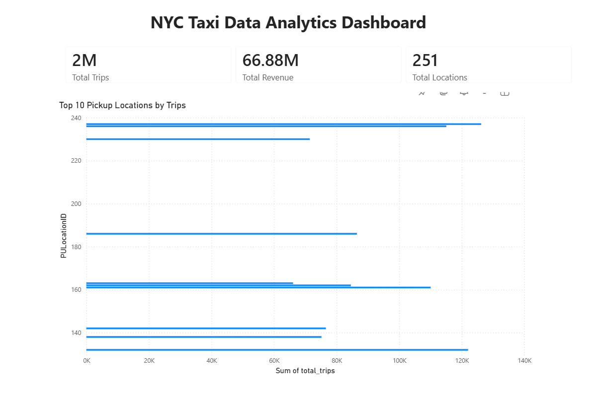

// Copyright Shashi Preetham Adhimulapu
# NYC Taxi Data Pipeline

## Overview
Built an end-to-end data pipeline using Azure and Databricks to process NYC taxi data and visualize insights using Power BI.

## Tech Stack
- Azure Data Lake Storage Gen2
- Databricks (PySpark)
- Power BI

## Architecture
Bronze → Silver → Gold

## Features
- Cleaned raw taxi data
- Created aggregated metrics (trips, revenue)
- Built dashboard for insights

## Dashboard

